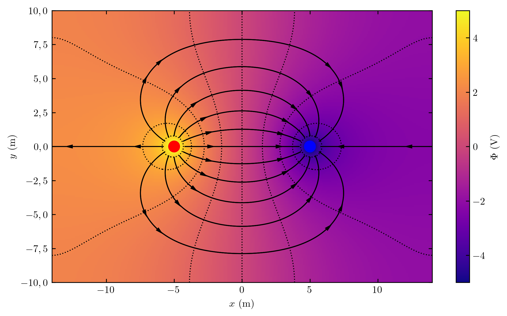
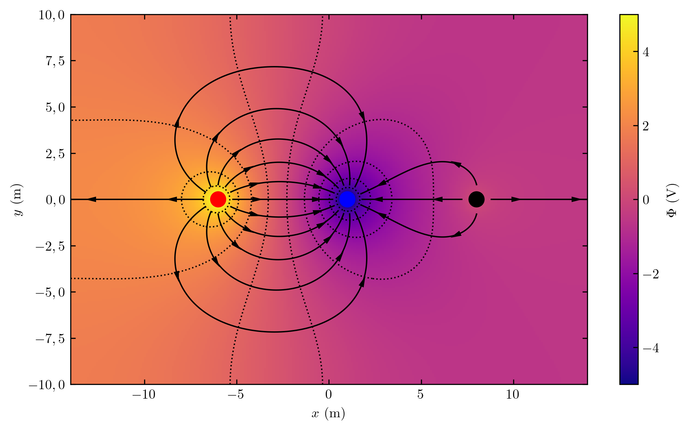
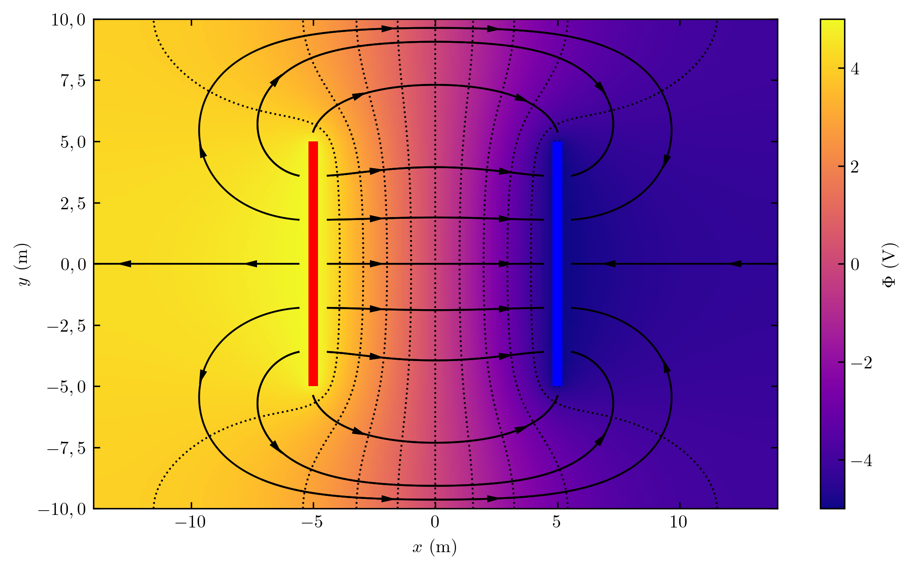
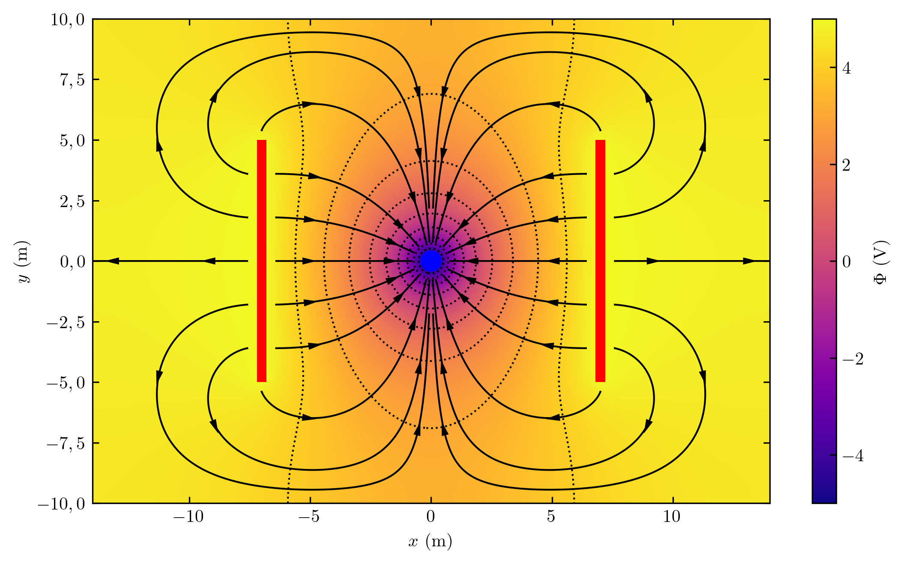
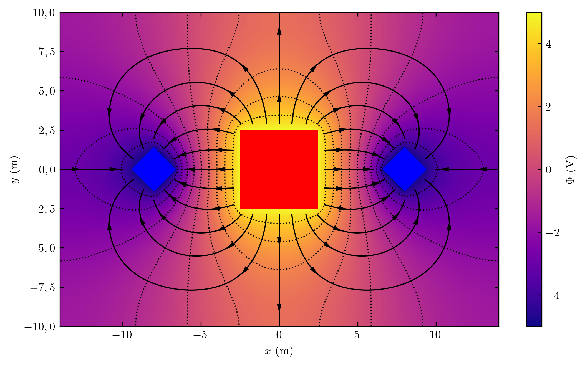
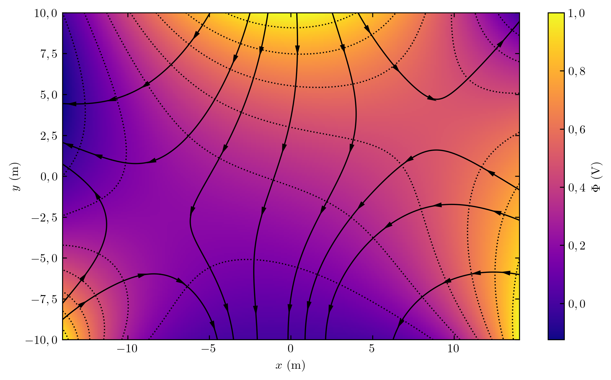
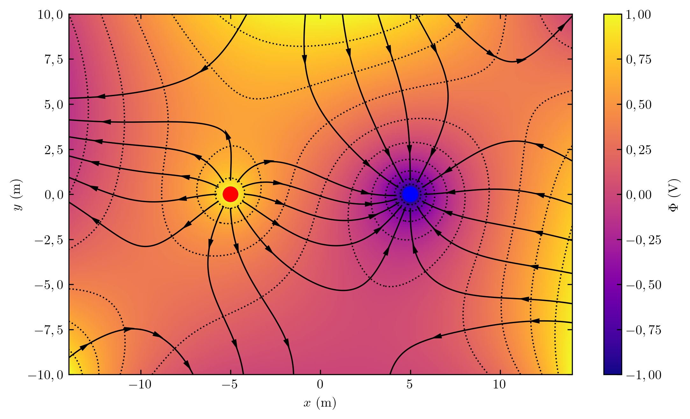

# Electrostatic-laplace-solver

 Representation of electrostatic systems by solving Laplace equation.

## Description

Language

- Python

Required packages

- shapely

## Gallery

**Examples - no boundary conditions**

1. Two filled circles

2. Three filled circles

3. Two parallel lines

4. Two parallel lines and one circle

5. Two diamonds and one square

**Examples - boundary conditions**

1. Empty

2. Two filled circles

## Upcoming features
1. Ring object
2. Arbitrary filled convex polygon
3. Arbitrary empty polygon
4. Arbitrary shape recongized from image detection
5. Implementation of numerical computation in C language
